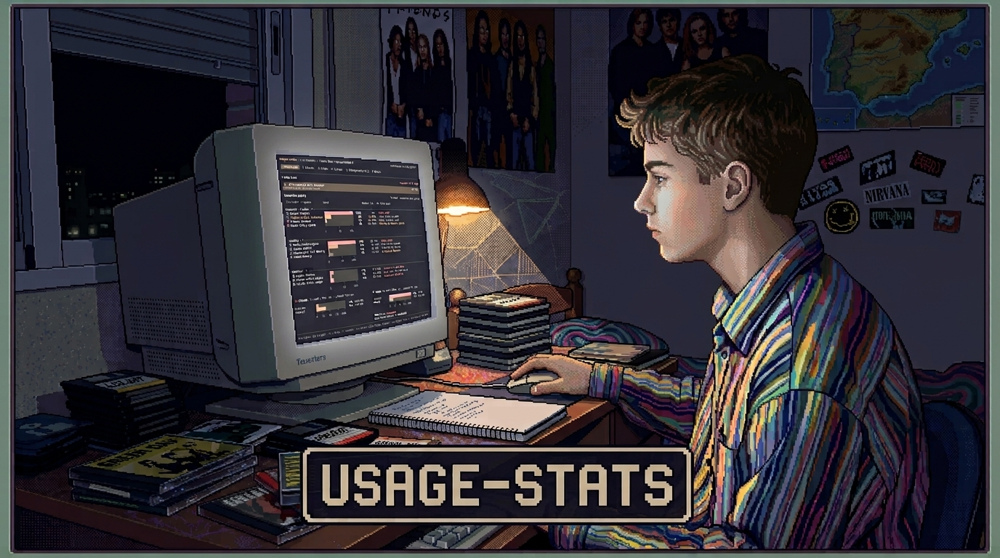
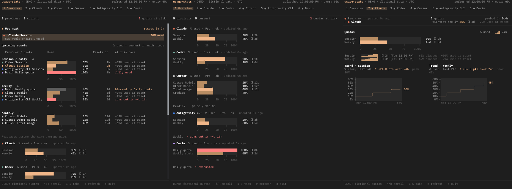

<p align="center">
  
</p>

<p align="center">
  <b>Monitor en vivo en terminal para las cuotas de tus suscripciones de IA.</b><br>
  Optimiza el consumo de tus modelos y aprovecha tus créditos antes de que expiren.
</p>

<p align="center">
  <a href="LICENSE"></a>
  <a href="https://bun.sh"></a>
  
</p>

---

## ⚡ Características

- 🔄 **En tiempo real**: Consulta periódica automática con cuentas atrás segundo a segundo hacia cada reinicio de cuota.
- 🎯 **Recomendación inteligente (`Use next`)**: Identifica al instante qué proveedor o modelo conviene usar según vencimiento y porcentaje en riesgo de caducar.
- 🕘 **Previsiones con tu horario**: Aprende del histórico a qué horas y qué días sueles trabajar (pestaña *Your hours*) y proyecta cada cuota sobre esas horas, no sobre un ritmo uniforme las 24 horas: una cuota semanal cuyo resto cae en noches y fin de semana dejará más saldo sin usar.
- ⚡ **Consumo rápido**: Compara el ritmo de la última hora con la media del periodo y avisa (`↑ fast`) cuando, a ese ritmo y en tus horas habituales, la cuota se agotaría antes de reiniciarse.
- 📐 **Plan fit**: Revisa los periodos ya cerrados de cada cuota (pico antes de cada reinicio y veces que se agotó) y dice si tu plan se queda corto, te sobra (con el nivel concreto en Claude: Pro, Max 5x, Max 20x) o encaja.
- 📜 **Modo footer (`--footer`)**: Unas pocas filas en vivo fijadas bajo el scrollback de la terminal, con un registro con hora de reinicios, umbrales superados, ráfagas y cambios de recomendación que puedes desplazar, buscar y copiar.
- ⏳ **Línea de tiempo de reinicios**: Vista unificada que agrupa cuotas por sesión, semana y mes, destacando sobreconsumos y bloqueos compartidos.
- 🔑 **Cero configuración**: Lee automáticamente las sesiones locales ya activas en tu equipo (incluye compatibilidad bidireccional entre WSL y Windows).
- 🖼️ **Gráficos en terminal**: Iconos vectoriales de alta definición vía **Kitty** o **Sixel**, con alternativa limpia en texto/color si la terminal no los soporta.
- 🔒 **Consulta directa y privada**: Sin servidores intermedios. Las credenciales se envían exclusivamente a las APIs permitidas del proveedor por HTTPS; los datos de cuenta se filtran antes de mostrarlos.

<p align="center">
  
</p>

---

## 🧩 Proveedores soportados

| Proveedor | Origen de sesión | Cómo iniciar sesión |
|---|---|---|
| **Claude** | `~/.claude/.credentials.json` (Keychain en macOS) | `claude` |
| **Codex** | `~/.codex/auth.json` (o `$CODEX_HOME`) | `codex` |
| **Cursor** | Base de datos SQLite `state.vscdb` (solo lectura) | App Cursor |
| **Antigravity CLI** | Credential store (`gemini`) o token local de agy | `agy` |
| **Devin** | `credentials.toml` del CLI o base de datos de la app | `devin auth login` |

> [!NOTE]
> **En WSL**: Localiza automáticamente las sesiones iniciadas tanto en el entorno Linux como en tu perfil de Windows (`/mnt/c/Users/<usuario>`).

---

## 🚀 Instalación

Requiere `curl` (y `python3` si no dispones de `unzip`). [Bun](https://bun.sh) se instala automáticamente si no está presente.

### Linux / macOS / WSL
```bash
git clone https://github.com/eguijarr/usage-stats.git
cd usage-stats
./install.sh
```

### Windows (PowerShell)
```powershell
git clone https://github.com/eguijarr/usage-stats.git
cd usage-stats
.\install.ps1
```

*(Opcional en WSL)*: Ejecuta `bash scripts/install-wt-profile.sh` para instalar la fuente IBM Plex Mono y añadir el perfil optimizado en Windows Terminal.

---

## 💻 Uso

```bash
usage-stats                  # Abre el dashboard interactivo
usage-stats --bg             # Modo segundo plano persistente (dtach / tmux)
usage-stats --wt             # Panel lateral dividido en Windows Terminal (WSL)
usage-stats --footer         # Filas en vivo bajo el scrollback, con registro de eventos encima
usage-stats -p claude,codex  # Filtrar proveedores específicos
usage-stats -i 30            # Definir intervalo de sondeo (segundos)
usage-stats --json           # Exportar datos en JSON para scripts
usage-stats --diagnose       # Diagnóstico de capacidades gráficas de la terminal
```

### Atajos de teclado

| Tecla | Acción |
|---|---|
| `1`–`9` / `Tab` | Alternar entre Overview y pestañas individuales |
| `j` / `k` o `↑` / `↓` | Desplazamiento vertical |
| `r` / `R` | Refrescar datos / Refresco forzado |
| `p` | Pausar o reanudar el refresco automático |
| `w` | Cambiar ventana de tendencias históricas (6h / 24h / 7d) |
| `+` / `-` | Ajustar intervalo de consulta (±15 s) |
| `q` / `Esc` | Volver al Overview / Salir |

En `--footer` solo se usan `r` / `R` (refrescar), `p` (pausar) y `q` / `Esc` (salir); la rueda del ratón
queda para la terminal, que desplaza el registro.

---

## ⚙️ Configuración

Puedes personalizar el comportamiento mediante variables de entorno:

| Variable | Descripción |
|---|---|
| `USAGE_STATS_INTERVAL` | Intervalo de refresco en segundos (por defecto `60`) |
| `USAGE_STATS_PROVIDERS` | Proveedores activos separados por coma (`claude,codex...`) |
| `USAGE_STATS_ICONS` | Renderizado de iconos: `auto`, `always` o `off` |
| `USAGE_STATS_BG` | Forzar `tmux` en lugar de `dtach` en el modo `--bg` |
| `USAGE_STATS_WT_SIZE` | Ancho relativo del panel dividido en Windows Terminal (ej: `0.3`) |
| `USAGE_STATS_HISTORY_DAYS` | Días de histórico local (por defecto `62`, entre `7` y `400`) |
| `XDG_DATA_HOME` | Directorio para el histórico local de métricas |

---

## 🔒 Privacidad y seguridad

- La pantalla y `--json` muestran cuotas, planes y saldos, pero no exportan perfiles ni respuestas
  completas de las APIs. Se ocultan credenciales conocidas, tokens reconocibles, correos y rutas
  personales; los errores inesperados no muestran detalles ni stacks.
- Las peticiones usan HTTPS, destinos permitidos y bloqueo de redirecciones. Devin solo admite
  `https://server.codeium.com`; no se envían sus credenciales a servidores personalizados.
- Claude y Codex guardan sus tokens renovados en el archivo original mediante temporales exclusivos
  de permiso `0600`. En macOS, las escrituras de Claude en el Keychain pasan la credencial por stdin,
  fuera de los argumentos del proceso. Los demás proveedores no guardan tokens renovados en disco.
- El histórico guarda solo fecha, proveedor, cuota y fracción consumida durante 62 días (configurable);
  las lecturas de más de 48 horas se compactan a una cada media hora. El perfil horario y el Plan fit se
  calculan en local a partir de él y no se guardan aparte. En
  Linux/macOS usa un directorio `0700` y un archivo `0600`; en Windows nativo depende de las ACL del
  perfil. Cursor se lee en modo de solo lectura. El socket de dtach usa un directorio privado.
- Git excluye los archivos habituales de credenciales, `.env`, históricos y logs. El diagnóstico
  oculta identificadores de sesión, rutas de tmux y el nombre de la distribución WSL.
- Una captura o un JSON compartido sigue revelando información de uso. La vista previa del README
  contiene únicamente datos ficticios y se identifica como **DEMO**.

La constante OAuth instalada de Antigravity es la del cliente público distribuido por el proyecto
original, no un token de tu cuenta. Google explica el modelo en su
[documentación de aplicaciones instaladas](https://developers.google.com/identity/protocols/oauth2/native-app).

La revisión, sus resultados y límites se documentan en [SECURITY.md](SECURITY.md).

---

## 🛠️ Desarrollo

```bash
bun install      # Instalar dependencias
bun start        # Iniciar en modo desarrollo
bun test         # Ejecutar suite de pruebas
bun run check    # Verificación de tipos TypeScript
bun run preview  # Regenerar la captura con datos ficticios (sin consultar cuentas)
```

---

## 📄 Licencia y Créditos

Distribuido bajo licencia [MIT](LICENSE).

- Diseño de interfaz inspirado en [pr-stats](https://github.com/d3lm/pr-stats) de Dominic Elm.
- Lógica de extracción de métricas basada en [OpenUsage](https://github.com/robinebers/openusage) y [CrossUsage](https://github.com/barramee27/crossusage).
- Fuente IBM Plex Mono bajo [SIL Open Font License 1.1](assets/fonts/IBMPlexMono-OFL.txt).
- Las marcas y logos corresponden a sus respectivos propietarios y se utilizan únicamente con fines identificativos.
